# Ralph Audit Commands

> **Disclaimer:** I made these for my own use. Sharing in case others find them useful.
> There might be bugs. Feel free to open issues or fork and customize.

Iterative security audit commands for [Claude Code](https://docs.anthropic.com/en/docs/claude-code).

## Commands

| Command | Iterations | Duration | Use Case |
|---------|------------|----------|----------|
| `/ralph-quick` | 10 | ~5-10 min | Quick pre-deploy check |
| `/ralph-security` | 100 | ~30-60 min | Standard audit |
| `/ralph-ultra` | 1,000 | ~4-8 hours | Deep dive |
| `/ralph-promax` | 10,000 | ~2-5 days | Maximum paranoia |

## Installation

Copy the files to `~/.claude/commands/`:

```bash
git clone https://github.com/dorukardahan/ralph-audit-commands.git
cp ralph-audit-commands/*.md ~/.claude/commands/
```

## How It Works

Each command includes an **Execution Engine** that forces iterative behavior:

```mermaid
flowchart LR
    A[STATE] --> B[PHASE]
    B --> C[ACTION]
    C --> D[REPORT]
    D --> E[SAVE]
    E --> F{iter ≤ N?}
    F -->|Yes| A
    F -->|No| G[FINAL]
```



**Key principles:**
- **One check per iteration** (not all at once)
- Progress shown as **[X/N]**
- Findings saved to **`.ralph-report.md`**

## Command Hierarchy


## What It Checks

- **OWASP Top 10** - SQLi, XSS, IDOR, SSRF, etc.
- **Secrets** - Hardcoded API keys, passwords, tokens
- **Containers** - Docker security, non-root, capabilities
- **Supply Chain** - Dependency CVEs, outdated packages
- **Auth & JWT** - Token security, session management
- **Infrastructure** - Ports, firewall, TLS/SSL
- **CI/CD** - Pipeline security, secret management

## Contributing

- Found a bug? Open an issue
- Have improvements? Send a PR
- Want to customize? Fork and make it yours

## License

MIT
